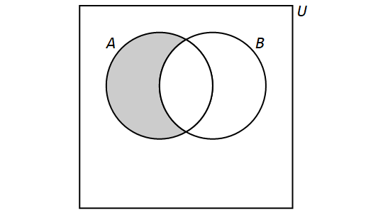

= Set Theory
== Sets

A *set* is an unordered collection of objects, called *elements* or *members*. A set is said to *contain* its elements. If $x$ is an element of the set $A,$ then we write $x \in A$. If $x$ is not an element of the set $A$, then we write $x \not\in A$.

For example, if $S$ is the set of states in the United States, then New York is an element of $S$ and Ontario is not an element of $S.$ If $E$ is the set of even integers, then $2 \in E$ and $3 \not\in E.$

There are several different ways to describe a set. One way of describing a set is known as the *roster method*. This is where we list all the elements of a set between curly braces. For example, $\{a,b,c\}$ is the set whose elements are $a,$ $b,$ and $c.$

In addition to _int_ (integer), _float_ and _string_, mentioned in the section on <<Data Types>>, one can build sets in Python using curly braces. Set data types are unordered and 
ignore duplicate elements.

:pt_code_height: 350
:pt_rawinput: false
:pt_code: A%20%3D%20%7B-2,0,1,4%7D%0Aprint%285%20in%20A%29%0Aprint%280%20in%20A%29

****
.Example {counter:setex} - Checking Set Membership in Python
--
--
The code below checks to see if $5$ and $0$ are elements of the set $A = \{-2,0,1,4\}.$ Since $5 \not\in A$ and $0 \in A,$ the code prints False followed by True.
include::python_tutor.adoc[]
****

:pt_code_height: 350
:pt_rawinput: false
:pt_code: A%20%3D%20%7B-2,0,1,4%7D%0Afor%20x%20in%20A%3A%0A%20%20%20%20print%28x,%20%22is%20an%20element%20of%20the%20set%22%29

****
.Example {counter:setex} - Listing the Elements of a Set in Python
--
--
The code below lists all of the elements of the set $A = \{-2,0,1,4\}.$
include::python_tutor.adoc[]
****

Another way of describing a set is the use of *set builder* notation. We write a set as \[\{x \in D : P(x)\}.\]This is the set of all elements $x$ from a domain $D$ that satisfy the predicate $P(x).$

****
.Example {counter:setex} - Switching between representations

Consider the following set: \[\{x \in \mathbb{Z} : -2 \leq x < 4\}.\] This is the set of all integers $x$ such that $-2$ is less than or equal $x$ and $x$ is less than 4. Using the roster method, this set can be written as \[\{-2,-1,0,1,2,3\}.\]

.You Try

Match each set described using set builder notation in parts (a) through (f) with the same set described using the roster method in parts (A) through (F).

a. $\{x \in \mathbb{Z} : x^2 = 1\}$
b. $\{x \in \mathbb{Z} : x^3 = 1\}$
c. $\{x \in \mathbb{Z} : |x| \leq 2\}$
d. $\{x \in \mathbb{Z} : x^2 < 4\}$
e. $\{x \in \mathbb{Z} : x < |x|\}$
f. $\{x \in \mathbb{Z} : (x + 1)^2 = x^2 + 2x + 1\}$

//

A. $\{-1,0,1\}$
B. $\{\dots, -3,-2,-1,0,1,2,3,\dots\}$
C. $\{1\}$
D. $\{\dots, -3,-2,-1\}$
E. $\{-1,1\}$
F. $\{-2,-1,0,1,2\}$
****

[NOTE]
====
When there are too many elements in a set for us to be able to list each one, we often use ellipses ($\dots$) when the pattern is obvious. For example, we have \[\mathbb{Z} = \{\dots,-3,-2,-1,0,1,2,3,\dots\}.\]
====

:pt_code_height: 350
:pt_rawinput: false
:pt_code: A%20%3D%20%7B-2,0,1,4%7D%0AB%20%3D%20%7Bx%20for%20x%20in%20A%20if%20x%20%3E%200%7D%0Aprint%28B%29

****
.Example {counter:setex} - Set Builder Notation in Python
--
--
The set $\{x \in D: P(x)\}$ can be expressed in Python as {for x in D if P(x)}. For example, the code below defines the set $B$ as the set of positive elements of the set $A = \{-2,0,1,4\}.$
include::python_tutor.adoc[]
****

We make frequent use of special sets and these are denoted with special symbols.

.Special sets of numbers
****
* $\mathbb{Z}$       ,   $\{-2,   -1, 0, 1, 2,...\}$ , the set of integers +
* $\mathbb{Z}^+$  or $\mathbb{N}$,    $\{1, 2, 3,...\}$, the set of natural numbers or positive integers +
* $\mathbb{Q}$ , $ \left\{\left.\frac{a}{b}\right|a\in \mathbb{Z},b\in \mathbb{Z},b\neq 0\right\}$, the set of rational numbers of the form
$\frac{2}{3}$  +
* $\mathbb{R}$, the set of real numbers +
* $\mathbb{R}^+$, the set of positive real numbers +
* $\mathbb{C}$, $\{a+ib|a\in \mathbb{R},b\in \mathbb{R},b\neq 0\}$, the set of complex numbers of the form $2+3i$. +

****

Other special sets will be defined as needed.

=== Empty Set
Consider the following set described using set builder notation: \[\{x \in \mathbb{Z} : x^2 = 2\}.\]This is the set of all integers whose square is equal to 2. However, no such integers exist. Therefore, using the roster method to describe it, this is the set $\{ \}.$

We call the set $\{ \}$ the *empty set* and denote this set by $\emptyset.$ The empty set has no elements.

:pt_code_height: 350
:pt_rawinput: false
:pt_code: def%20Elements%28A%29%3A%0A%20%20%20%20if%20A%20%3D%3D%20set%28%29%3A%0A%20%20%20%20%20%20%20%20print%28%22the%20set%20is%20empty%22%29%0A%20%20%20%20else%3A%0A%20%20%20%20%20%20%20%20for%20x%20in%20A%3A%0A%20%20%20%20%20%20%20%20%20%20%20%20print%28x,%20%22is%20an%20element%20of%20the%20set%22%29
****
.Example {counter:setex} - Listing the Elements of a Nonempty Set
--
--
Since Python interprets {} as an empty dictionary, we cannot use this notation for the empty set. Instead, we must write the empty set as follows:

set()

The function in the code below checks to see if a set is empty. If the set is nonempty, its elements are listed.
include::python_tutor.adoc[]
****

[NOTE]
====
It is important to note that $\{\}$ and $\emptyset$ are both ways to write the empty set. However, the set $\{ \emptyset \}$ is not the empty set; rather, it is a set which contains a single element. The single element conained in the set $\{ \emptyset \}$ is the empty set. In general, the set $A$ is not the same as the set $\{ A \}.$
====

=== Cardinality

Suppose that a set $A$ contains a finite number of distinct elements. We refer to the number of elements of $A$ as the *cardinality* of $A$ and denote this by $|A|$. If $A$ contains an infinite number of distinct elements, we say that $A$ has infinite cardinality and we write $|A| = \infty.$

Thus, we see that $|\{0,1,2\}| = 3$ and $|\mathbb{Z}| = \infty.$ Additionally, note that $|\emptyset| = 0.$

:pt_code_height: 350
:pt_rawinput: false
:pt_code: A%20%3D%20%7B2,3,5,8%7D%0AB%20%3D%20set%28%29%0AC%20%3D%20%7B0%7D%0Aprint%28len%28A%29%29%0Aprint%28len%28B%29%29%0Aprint%28len%28C%29%29%0A

****
.Example {counter:setex} - Cardinality in Python
--
--
The cardinality of a set $A$ can be computed in Python as follows:

len(A)
include::python_tutor.adoc[]
****

=== Equality

We say that two sets are *equal* if and only if they contain the same elements. In other words, $A$ and $B$ are equal sets if and only if \[\forall x (x \in A \iff x \in B).\]When $A$ and $B$ are equal sets, we write $A = B$. When $A$ and $B$ are not equal sets, we write $A \neq B$.

The sets $\{2,3,5\}$ and $\{5,2,3\}$ are equal sets, since they contain the same elements. The order in which the elements of a set are listed does not matter. Additionally, it does not matter whether elements are repeated. Thus, the sets $\{a,b,c\}$ and $\{b,b,a,c,b,a,c,c,c\}$ are equal sets as well.

=== Subsets

We say that a set $A$ is a *subset* of a set $B$ if and only if every element of $A$ is an element of $B.$ In other words, $A$ is a subset of $B$ if and only if \[\forall x (x \in A \implies x \in B).\]When $A$ is a subset of $B,$ we write $A \subseteq B$. When $A$ is not a subset of $B,$ we write $A \not\subseteq B$.

In order to show that $A$ is a subset of $B,$ we must show that, whenever $x \in A,$ it is also the case that $x \in B.$ In order to show that $A$ is not a subset of $B,$ we must find a single $x$ such that $x \in A$ but $x \not \in B.$

****
.Example {counter:setex}
If we let $S = \{1,5\}$ and $T = \{1,3,5\},$ then $S \subseteq T,$ since each element of $S$ is an element of $T,$ but $T \not\subseteq S,$ since $3$ is an element of $T$ that is not an element of $S.$

If we let $A$ be the set of professional athletes and let $F$ be the set of professional football players, we have $F \subseteq A,$ since every professional football player is a professional athlete, but $A \not\subseteq F,$ since not every professional athlete is a professional football player.
****

Note that, for any set $A,$ it is always the case that $\emptyset \subseteq A$ and $A \subseteq A.$ For any sets $A$ and $B,$ if $A \subseteq B$ and $B \subseteq A,$ then $A = B.$

If $A \subseteq B$ and $B$ contains at least one element that is not in A, then we say $A$ is a *proper subset* of $B$, denoted $A \subset B$.

:pt_code_height: 350
:pt_rawinput: false
:pt_code: A%20%3D%20%7B2,4,6,8,10,12%7D%0AB%20%3D%20%7B4,8,12%7D%0Aprint%28A.issubset%28B%29%29%0Aprint%28B%20%3C%3D%20A%29%0A

****
.Example {counter:setex} - Subsets in Python
--
--
In Python, we can check whether a set $A$ is a subset of a set $B$ in one of the following ways:

A.issubset(B) +
A \<= B.
include::python_tutor.adoc[]
****

=== Power Set

Given a set $A,$ we refer to the *power set* of $A$ as the set of all subsets of $A.$ The power set of $A$ is denoted by $\mathcal{P}(A).$

[NOTE]
====
$\mathcal{P}(A)$ is a set whose elements are all sets.
====

If we let $A = \{a,b,c\},$ we see that \[\mathcal{P}(A) = \{\emptyset, \{ a \}, \{ b \}, \{ c \}, \{a,b\}, \{a,c\}, \{b,c\}, \{a,b,c\}\}.\] The empty set only has the empty set as a subset. Thus, we see that \[\mathcal{P}(\emptyset) = \{\emptyset\}.\]We can also take the power set of a power set. For example, we have the following:

[env.equationalign]
--
\mathcal{P}(\{ 1 \}) &= \{\emptyset, \{ 1 \}\},\\
\mathcal{P}(\mathcal{P}(\{ 1 \}) &= \mathcal{P}(\{\emptyset, \{ 1 \})\\
&= \{\emptyset, \{\emptyset\}, \{ \{ 1 \} \}, \{\emptyset, \{ 1 \}\}\}.
--

.Cardinality of Power Set
****
If $A$ is a finite set such that $|A| = n,$ then $\left|\mathcal{P}(A)\right| = 2^n.$
****

== Set Operations

We can obtain new sets by performing operations on other sets. When performing set operations, it is often helpful to consider all of our sets as subsets of a *universal set* $U.$ We can think of the universal set as the set of all of the objects under consideration.

We can represent set operations visually using *Venn diagrams*, named after the English mathematician John Venn. A Venn diagram will consist of a rectangle, which represents the universal set, and one or more circles, which represent the sets under consideration. We will then shade in the regions of the diagram that correspond to one or more set operations.

=== Union

The *union* of the sets $A$ and $B$ is the set containing those elements that are in $A$ or $B$ or both, and is denoted by $A \cup B$. More formally, \[A \cup B = \{x \in U : x \in A \lor x \in B\}.\]

We have the following Venn Diagram for $A \cup B$:

image::images/Union.png[]

Note that, for any sets $A$ and $B,$ \[A \cup B = B \cup A.\]

****
.Example {counter:setex}
If we let $A = \{1,2,3,4,5,6\}$ and $B = \{1,3,5,7,9\},$ then \[A \cup B = \{1,2,3,4,5,6,7,9\}.\]
****

:pt_code_height: 350
:pt_rawinput: false
:pt_code: A%20%3D%20%7B-3,-1,2,5%7D%0AB%20%3D%20%7B-1,%200,%202%7D%0A%0Aprint%28A.union%28B%29%29%0Aprint%28A%20%7C%20B%29
****
.Example {counter:setex} - Union in Python
--
--
In Python, we can compute the union of sets $A$ and $B$ in one of the following ways:

A.union(B) +
A | B
include::python_tutor.adoc[]
****

=== Intersection

The *intersection* of the sets $A$ and $B$ is the set containing those elements that are in $A$ and $B$ and is denoted by $A \cap B$. More formally, \[A \cap B = \{x \in U : x \in A \land x \in B\}.\]

We have the following Venn Diagram for $A \cap B$:

image::images/Intersection.png[]

Note that, for any sets $A$ and $B,$ \[A \cap B = B \cap A.\] If it is the case that $A \cap B = \emptyset,$ then we say that $A$ and $B$ are *disjoint*. In other words, two sets are disjoint if and only if they contain no elements in common.

****
.Example {counter:setex}
If we let $A = \{1,2,3,4,5,6\}$ and $B = \{1,3,5,7,9\},$ then \[A \cap B = \{1,3,5\}.\]
****

:pt_code_height: 350
:pt_rawinput: false
:pt_code: A%20%3D%20%7B-3,-1,2,5%7D%0AB%20%3D%20%7B-1,%200,%202%7D%0A%0Aprint%28A.intersection%28B%29%29%0Aprint%28A%20%26%20B%29
****
.Example {counter:setex} - Intersection in Pythong
--
--
In Python, we can compute the intersection of sets $A$ and $B$ in one of the following ways:

A.intersection(B) +
A & B
include::python_tutor.adoc[]
****

=== Difference

The *difference* of the sets $A$ and $B$ is the set containing those elements that are in $A$ but not in $B$ and is denoted by $A \setminus B$. Set difference is also denoted by $A - B$. More formally, \[A \setminus B = \{x \in U: x \in A \land x \not\in B\}.\]

We have the following Venn Diagram for $A \setminus B$:

Note that, for any sets $A$ and $B,$ if $A = B,$ then $A \setminus B = \emptyset$ and $B \setminus A = \emptyset$. Thus, when $A = B,$ \[A\setminus B = B \setminus A.\] However, if $A \neq B,$ then \[A \setminus B \neq B \setminus A.\]

****
.Example {counter:setex}
If we let $A = \{1,2,3,4,5,6\}$ and $B = \{1,3,5,7,9\},$ then \[A \setminus B = \{2,4,6\}\] and \[B \setminus A = \{7,9\}.\]
****

:pt_code_height: 350
:pt_rawinput: false
:pt_code: A%20%3D%20%7B-3,-1,2,5%7D%0AB%20%3D%20%7B-1,%200,%202%7D%0A%0Aprint%28A.difference%28B%29%29%0Aprint%28B%20-%20A%29
****
.Example {counter:setex} - Difference in Python
--
--
In Python, we can compute the difference of sets $A$ and $B$ in one of the following ways:

A.difference(B) +
A - B
include::python_tutor.adoc[]
****

=== Complement

The *complement* of a set $A$ is the set of all elements in the universal set $U$ which are not elements of $A$ and is denoted by $\overline{A}.$ More formally, \[\overline{A} = \{x \in U: x \not\in A\}.\]

We have the following Venn Diagram for $\overline{A}$:

image::images/ComplementA.png[]

For any set $A,$ \[\overline{A} = U \setminus A.\]

****
.Example {counter:setex}
Suppose that our universal set is $U = \{0,1,2,3,4,5,6,7,8,9\},$ the set of all decimal digits. If we let $A = \{1,2,3,4,5,6\}$ and $B = \{1,3,5,7,9\},$ then \[\overline{A} = \{0,7,8,9\}\] and \[\overline{B} = \{0,2,4,6,8\}.\]

.Example {counter:setex}
Suppose that our universal set is $\mathbb{Z}.$ If we let $E$ be the set of all even integers, then $\overline{E}$ is the set of all odd integers.
****

=== Multiple Set Operations

We can also perform more than one set operation on a collection of sets. For example, let $A,$ $B,$ and $C$ be sets and consider the following set: \[(A \setminus B) \cup (C \setminus B).\]This is the set that is obtained by taking the union of the sets $A \setminus B$ and $C \setminus B.$ We have \[(A \setminus B) \cup (B \setminus A) = \{x \in U: (x \in A \land x \not\in B) \lor (x \in C \land x \not\in B)\}.\]

We have the following Venn Diagram for $(A \setminus B) \cup (C \setminus B)$:

image::images/AminusBunionCminusB.png[]

*Video Example 1*

++++
<iframe id="kaltura_player" src="https://cdnapisec.kaltura.com/p/2022371/sp/202237100/embedIframeJs/uiconf_id/31860982/partner_id/2022371?iframeembed=true&playerId=kaltura_player&entry_id=0_vmm8v9kh&flashvars[streamerType]=auto&amp;flashvars[localizationCode]=en&amp;flashvars[leadWithHTML5]=true&amp;flashvars[sideBarContainer.plugin]=true&amp;flashvars[sideBarContainer.position]=left&amp;flashvars[sideBarContainer.clickToClose]=true&amp;flashvars[chapters.plugin]=true&amp;flashvars[chapters.layout]=vertical&amp;flashvars[chapters.thumbnailRotator]=false&amp;flashvars[streamSelector.plugin]=true&amp;flashvars[EmbedPlayer.SpinnerTarget]=videoHolder&amp;flashvars[dualScreen.plugin]=true&amp;flashvars[Kaltura.addCrossoriginToIframe]=true&amp;&wid=1_cwiqknv4" width="700" height="500" allowfullscreen webkitallowfullscreen mozAllowFullScreen allow="autoplay *; fullscreen *; encrypted-media *" sandbox="allow-forms allow-same-origin allow-scripts allow-top-navigation allow-pointer-lock allow-popups allow-modals allow-orientation-lock allow-popups-to-escape-sandbox allow-presentation allow-top-navigation-by-user-activation" frameborder="0" title="Kaltura Player"></iframe>
++++

*Video Example 2*

++++
<iframe id="kaltura_player" src="https://cdnapisec.kaltura.com/p/2022371/sp/202237100/embedIframeJs/uiconf_id/31860982/partner_id/2022371?iframeembed=true&playerId=kaltura_player&entry_id=0_9p3m4lin&flashvars[streamerType]=auto&amp;flashvars[localizationCode]=en&amp;flashvars[leadWithHTML5]=true&amp;flashvars[sideBarContainer.plugin]=true&amp;flashvars[sideBarContainer.position]=left&amp;flashvars[sideBarContainer.clickToClose]=true&amp;flashvars[chapters.plugin]=true&amp;flashvars[chapters.layout]=vertical&amp;flashvars[chapters.thumbnailRotator]=false&amp;flashvars[streamSelector.plugin]=true&amp;flashvars[EmbedPlayer.SpinnerTarget]=videoHolder&amp;flashvars[dualScreen.plugin]=true&amp;flashvars[Kaltura.addCrossoriginToIframe]=true&amp;&wid=1_pcesgshn" width="700" height="500" allowfullscreen webkitallowfullscreen mozAllowFullScreen allow="autoplay *; fullscreen *; encrypted-media *" sandbox="allow-forms allow-same-origin allow-scripts allow-top-navigation allow-pointer-lock allow-popups allow-modals allow-orientation-lock allow-popups-to-escape-sandbox allow-presentation allow-top-navigation-by-user-activation" frameborder="0" title="Kaltura Player"></iframe>
++++

****
.You Try

Draw Venn Diagrams for each of these combinations of the sets $A$, $B$, and $C$.

1. $A \cap (B \cup C)$
2. $(A \cap B) \cup C$
3. $(\overline{A} \cap \overline{C}) \cup B$
4. $(B \cup C) \setminus A$
****

=== The Cartesian Product

The *Cartesian product* of two sets $A$ and $B$ is the set of _ordered pairs_
defined by,

$  A\times B=\{(a,b)|a\in A\wedge b\in B)\}$,

****
.Example {counter:setex}

Consider the sets, $B=\{0,1\}$, $T=\{0,1,2\}$, and, $C=\{a,\ b,\ c, d\}$.
Determine the Cartesian products, and their cardinalities.

.. $B\ \times\ C$
.. $C\times B$
.. $B\ \times\ T$
.. $B\ \times\ B$
.. $B\ \times\ B\times B$

.Solution

For the set, $ B\ \times C $, notice that
this will be all ordered pairs of the form,
$(a,b)$, with $a \in B$, and $b \in C$, giving,

$B\ \times\ C=\{(0,a), (0,b), (0,c), (0,d),(1,a), (1,b), (1,c), (1,d))\}$,
which has $2 × 4=8$, elements.

For $C\ \times\ B$, switch the ordering, for $B\ \times\ C$, to obtain the set with $8$,
elements,

$C\ \times  B=\{(a,0), (b,0), (c,0),(d,0),(a,1), (b,1), (c,1), (d,1)\}$,

The set $B \times T$,
will be all ordered pairs of the form,
$(a,b)$, with $a \in B$, and $b \in T$, giving, the set with $2 × 3=6$, elements,

$B \times T=\{(0,0),(0,1),(0,2),(1,0),(1,1),(1,2)\}$,

The set $B \times B$,
will be all order pairs  of the form,
$(a,b)$, with $a, b \in B$, giving the set with  $2 × 2=4$, elements,

$B \times T=\{(0,0),(0,1),(1,0),(1,1)\}$,

Finally the set $B \times B \times B$, will be the set of all
ordered triples of the form,
$(a,b,c)$, with $a, b, c \in B$, giving the set with  $2 × 2 × 2=8$, elements,

$B \times B \times B=\{(0,0,0),(0,0,1),(0,1,0),(0,1,1),(1,0,0),(1,0,1),(1,1,0),(1,1,1)\}$,
****

[NOTE]
====
Because Cartesian products are created using ordered pairs, $B \times C$, is, in general,
different from $C \times   B$.

====

[NOTE]
====
If the cardinality of set $|A|=a$, and the cardinality of
set $|B|=b$, then the cardinality of the Cartesian product is $|A × B|=ab$

====

[NOTE]
====
The Cartesian coordinate systems are natural sets that are naturally Cartesian products.
The two-dimensional plane, and the three-dimensional space are represented by the following
Cartesian product sets,

$\mathbb{R}^2=\mathbb{R}\times \mathbb{R}=\{(x,y)|x,y\in \mathbb{R}\}$, and,

$\mathbb{R}^3=\mathbb{R}\times \mathbb{R}\times \mathbb{R}=\{(x,y,z)|x,y,z\in \mathbb{R}\}$

====

== Representing Sets as Lists

We can represent sets in Python using lists. The empty set $\{ \}$ is represented by the empty list []. Several different lists may represent the same set. For example, the lists [2, 0, 1] and [1, 2, 2, 0, 1, 0, 1] both represent the set $\{0,1,2\}.$

It can be helpful for us to remove duplicate elements from a list. For example, this will be necesssary when computing the cardinality of a set.

:pt_code_height: 450
:pt_rawinput: false
:pt_code: def%20RemoveDuplicates%28A%29%3A%0A%20%20%20%20B%20%3D%20%5B%5D%0A%20%20%20%20for%20x%20in%20A%3A%0A%20%20%20%20%20%20%20%20if%20x%20not%20in%20B%3A%0A%20%20%20%20%20%20%20%20%20%20%20%20B%20%2B%3D%20%5Bx%5D%0A%20%20%20%20return%20B%0A%0Adef%20Cardinality%28A%29%3A%0A%20%20%20%20AA%20%3D%20RemoveDuplicates%28A%29%0A%20%20%20%20return%20len%28AA%29
****
.Example {counter:setex} - Remove Duplicates and Cardinality in Python
--
--
The following code contains a function that removes duplicate elements from a set and another that computes the cardinality of a set.

include::python_tutor.adoc[]
****

For the rest of the section, we will assume that none of our lists have duplicate elements. Otherwise, we can add one or more lines to each program given below to remove duplicated elements.

We can test whether two sets are equal by testing whether the first is a subset of the second and whether the second is a subset of the first.

:pt_code_height: 450
:pt_rawinput: false
:pt_code: def%20Subset%28A,B%29%3A%0A%20%20%20%20for%20x%20in%20A%3A%0A%20%20%20%20%20%20%20%20if%20x%20not%20in%20B%3A%0A%20%20%20%20%20%20%20%20%20%20%20%20return%20False%0A%20%20%20%20return%20True%0A%0Adef%20Equal%28A,B%29%3A%0A%20%20%20%20if%20Subset%28A,B%29%20and%20Subset%28B,A%29%3A%0A%20%20%20%20%20%20%20%20return%20True%0A%20%20%20%20else%3A%0A%20%20%20%20%20%20%20%20return%20False%0A
****
.Example {counter:setex} - Subset and Equal in Python
--
--
The followwing code contains a function that checks whether one set is a subset of another and a function that checks whether two sets are equal.

include::python_tutor.adoc[]
****

One benefit to using lists instead of sets is that Python does not allow the elements of a set to be sets, but the elements of a list can be lists. This allows us to represent the power set of a set as a list. For example, the power set of [1, 2] is

[.text-center]
[[], [1], [2], [1,2]].

We can also represent the union, intersection, and difference of two sets.

:pt_code_height: 450
:pt_rawinput: false
:pt_code: def%20Union%28A,B%29%3A%0A%20%20%20%20C%20%3D%20%5B%5D%0A%20%20%20%20for%20x%20in%20A%3A%0A%20%20%20%20%20%20%20%20if%20x%20not%20in%20C%3A%0A%20%20%20%20%20%20%20%20%20%20%20%20C%20%2B%3D%20%5Bx%5D%0A%20%20%20%20for%20x%20in%20B%3A%0A%20%20%20%20%20%20%20%20if%20x%20not%20in%20C%3A%0A%20%20%20%20%20%20%20%20%20%20%20%20C%20%2B%3D%20%5Bx%5D%0A%20%20%20%20return%20C
****
.Example {counter:setex} - Union in Python
--
--
The following code contains a function that finds the union of two sets.

include::python_tutor.adoc[]
****

:pt_code_height: 450
:pt_rawinput: false
:pt_code: def%20Intersection%28A,B%29%3A%0A%20%20%20%20C%20%3D%20%5B%5D%0A%20%20%20%20for%20x%20in%20A%3A%0A%20%20%20%20%20%20%20%20if%20x%20in%20B%3A%0A%20%20%20%20%20%20%20%20%20%20%20%20if%20x%20not%20in%20C%3A%0A%20%20%20%20%20%20%20%20%20%20%20%20%20%20%20%20C%20%2B%3D%20%5Bx%5D%0A%20%20%20%20return%20C
****
.Example {counter:setex} - Intersection in Python
--
--
The following code contains a function that finds the intersection of two sets.

include::python_tutor.adoc[]
****

:pt_code_height: 450
:pt_rawinput: false
:pt_code: def%20Difference%28A,B%29%3A%0A%20%20%20%20C%20%3D%20%5B%5D%0A%20%20%20%20for%20x%20in%20A%3A%0A%20%20%20%20%20%20%20%20if%20x%20not%20in%20B%3A%0A%20%20%20%20%20%20%20%20%20%20%20%20if%20x%20not%20in%20C%3A%0A%20%20%20%20%20%20%20%20%20%20%20%20%20%20%20%20C%20%2B%3D%20%5Bx%5D%0A%20%20%20%20return%20C%0A
****
.Example {counter:setex} - Difference in Python
--
--
The following code contains a function that finds the difference of two sets.

include::python_tutor.adoc[]
****

== Exercises
. Consider as universal set, the set of all $26$, lowercase letters of the English alphabet,
$U=\{a,b,c,…,v,w,x,y,z\}$, and the sets $A=\{a,b,c,d,e,f,g,h\}$, $B=\{f,g,h,i,j,k\}$, and $C=\{x,y,z\}$. For the sets given below:
.. List the sets below using roster form, and
.. Draw Venn Diagrams for each of the sets

... $A\cup B$
... $A\cap B$
... $A\cup C$
... $A\cap C$
... $A \setminus B$
... $B \setminus A$
... $A \setminus C$
... $C \setminus A$
... $A\cup C$
... $A\cap C$
... $\overline{A}$
... $\overline{B}$
... $\overline{C}$
... $\overline{B} \cap \overline{C}$
... $ (\overline{A} \cap \overline{B}) \cup (\overline{B} \cap \overline{C})$

. Using Venn Diagrams, determine which of the following are equivalent
.. $A \setminus (A \setminus B)),$
+
$A\cup B,$ and
+
$A\cap B$

.. $A\cup  \overline{A},$
+
$A\cap  \overline{A},$
+
$U,$ and
+
$\emptyset$

..   $\overline{A}\cap  \overline{B}, $
+
$\overline{A\cap B},$
+
$\overline{A}\cup  \overline{B},$ and
+
$\overline{A\cup B}$

.. $A\cup (B\cap C),$
+
$A\cap (B\cup C),$
+
$(A\cap B)\cup (A\cap C),$ and
+
$(A\cup B)\cap (A\cup C),$

.. $\overline{\overline{A}\cup(C \setminus B) }),$
+
$A\cap (B \cup \overline{C}),$ and
+
$A \setminus (C \setminus B)$

. Write each of the following sets using set builder notation

.. $\{\ldots, -9, -7, -5, -3, -2, -1, 1, 3, 5, 7, 9, \ldots \}$
.. $\{\ldots, -8, -6, -4, -2, 0, 2, 4, 6, 8, 10,\ \ldots \}$
.. $\{ 1, 2, 3, 4, 5,  6, 7, 8, 9, 10 \}$
.. $\left\{ 1,\frac{1}{2},\frac{1}{3},\frac{1}{4},\frac{1}{5},\ldots \right\}$
.. $\{0, 1, 4, 9, 16, 25, 36, 49, \ldots \}$
.. $\{\ldots,-10,-6, -2, 2, 6, 10, 14, 18, 22, \ldots \}$
.. $\{ 3, 9, 27, 81, 243,\ldots\}$
.. $\{ 1, 9, 25, 49, 81, \ldots \}$

. Write each of the following sets in roster form

.. $\{x \in \mathbb{R} : |2x+5|=7\}$
.. $\{10n : n \in \mathbb{N}\}$
.. $\{10n : n \in \mathbb{Z}\}$
.. $\left\{2^n : n \in \mathbb{N}\right\}$
.. $\left\{2^n : n \in \mathbb{Z}\right\}$
.. $\left\{x \in \mathbb{R} : x^2=4\right\}$
.. $\left\{x \in \mathbb{R} : x^3=64\right\}$
.. $\left\{x \in \mathbb{Z} : x^2=5\right\}$
.. $\left\{x \in \mathbb{R} : x^2= -4\right\}$
.. $\left\{x \in \mathbb{Z} : |x-5|=3\right\}$
.. $\left\{3n+4 : n \in \mathbb{N}\right\}$
.. $\left\{3n+4 : n \in \mathbb{Z}\right\}$
.. $\left\{i^n : n \in\mathbb{N}\right\}$, where $i$ is such that $i^2=-1$ (the imaginary unit).

. Consider the  sets $A=\{1, 3, 5, 7, 9, 11, 13, 15, 17\}$, $B=\{2, 5, 7, 11\}$, and $C=\{1, 2, 3\}$,
.. Determine the cardinalities of following sets,
... $|A|$
... $|A\cup B|$
... $|A\cap C|$
... $|\mathcal{P}(A)|$
... $|\mathcal{P}(B)|$
... $|\mathcal{P}(C)|$

.. Give the following power sets,
... $\mathcal{P}(B)$
... $\mathcal{P}(C)$

. Determine the cardinalities of following sets,
.. $\{n \in \mathbb{Z} : |n|\leq 10\}$
.. $\{A,B, \emptyset,\{2,5,6\}\}$
.. $\{\{A,B\},\{\},\{\{2,5,6\}\},\{\{2,5,6\},C\},\{A,B,C\}\}$
.. $\{\{\{A,B\},\emptyset,\{\{2,5,6\},C\},\{A,B,C\}\}\}$

. Consider the sets, $B=\{0, 1\}$, $ S=\{spring, summer, fall, winter\}$, and
$C=\{ a, b, c, d,e\}$. For each of the following sets:
.. Determine the following Cartesian products.
.. Calculate the cardinality of each Cartesian product.
... $B \times S$
... $S \times B$
... $B \times C$
... $C \times B$
... $B \times B \times B \times B$
... $S  \times B \times B$

. Determine the following power sets,
.. $\mathcal{P}(\{Alabama, Georgia, Florida, Louisiana\} )$
.. $\mathcal{P}(\emptyset )$
.. $\mathcal{P}(\{\emptyset\} )$
.. $\mathcal{P}(\{Alabama \} )$
.. $\mathcal{P}(\{Alabama, Georgia, Florida \} )$
.. $\mathcal{P}(\{\{Alabama, Georgia \}, \{Florida \} \} )$

. Write the shaded regions in each of the following Venn diagrams using set notation.
+
image::images/venn_exercises.png[GGC,1000,1000]

. Determine if each of the following are true or false. Explain your reasoning.
.. $\{7,4,6,2,11,3,5\}\subseteq \{1,2,3,4,5,6,7,8,9,10,11,12,13\}$
.. $\{1,2,3,4,5,6,7,8,9,10,11,12,13\}\subseteq \{7,4,6,2,11,3,5\}$
.. $\{7,4,6,2,11,3,5\}\subseteq \{7,4,6,2,11,3,5\}$
.. $\{3,8\}\nsubseteq \{7,4,6,2,11,3,5\}$
.. $ \{3n+4 : n \in \mathbb{N}\} \nsubseteq \mathbb{Z}$
.. $\mathbb{N}\subseteq \mathbb{Z}\subseteq \mathbb{Q}\subseteq \mathbb{R}$
.. $\{x \in \mathbb{R} : |x|<3\}\subseteq \{x \in \mathbb{R}||x|<5\}$
.. $\{x \in \mathbb{R} : |x|>3\}\subseteq \{x \in \mathbb{R}||x|>5\}$
